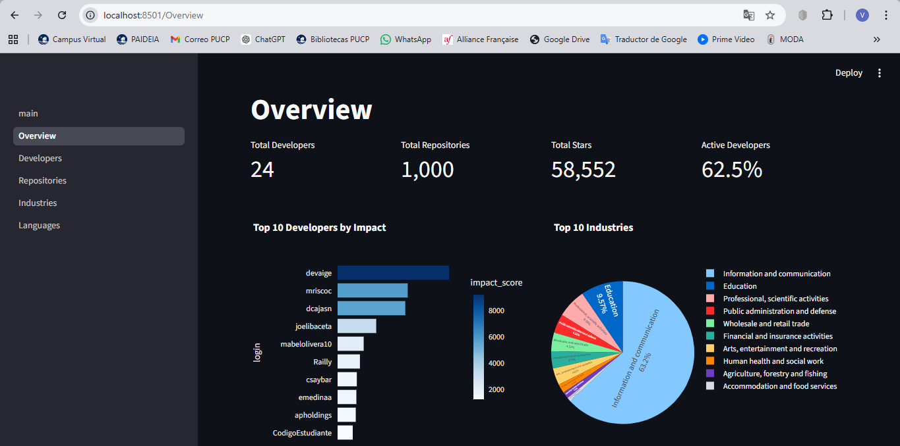
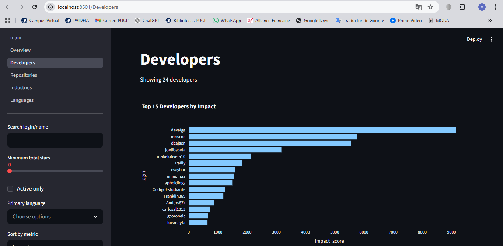
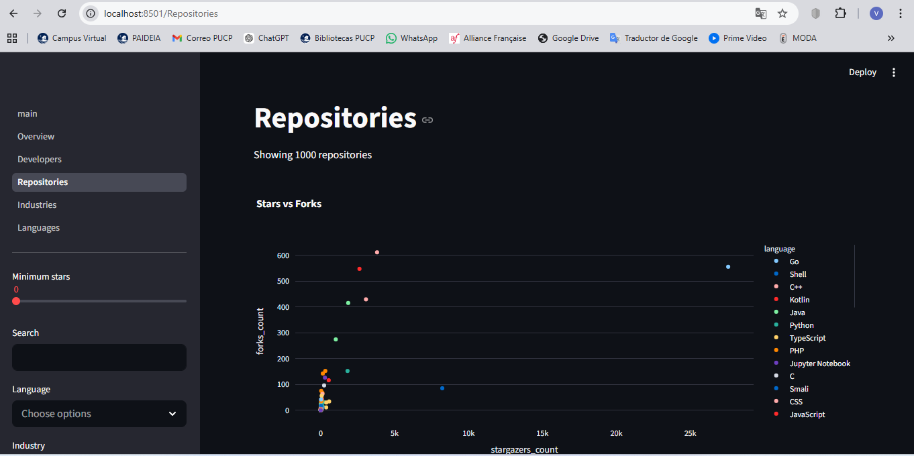
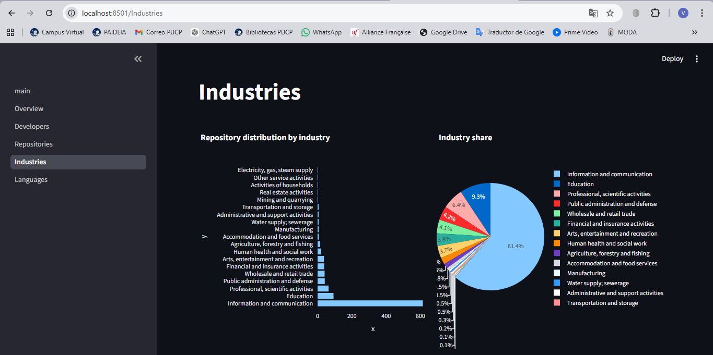
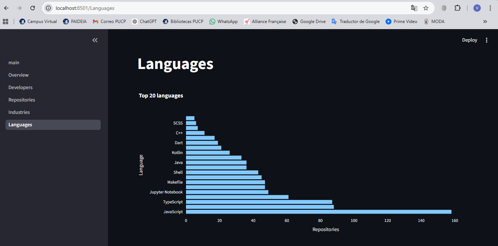

# GitHub Peru Analytics: Developer Ecosystem Dashboard

Plataforma de analítica para extraer, clasificar y visualizar el ecosistema de desarrolladores de Perú en GitHub usando API REST, GPT-4 y Streamlit.

## 1. Project Title and Description
**GitHub Peru Analytics** analiza repositorios y desarrolladores asociados a Perú, clasifica repositorios en 21 industrias CIIU con GPT-4, calcula métricas de usuario y ecosistema, y presenta resultados en un dashboard interactivo de 5 páginas.

Antigravity Easter Egg (evidencia requerida):
- Ejecutado con `python antigravity_demo.py`
- Captura incluida en `demo/antigravity_screenshot.png`


## 2. Key Findings
Top 5 insights sobre el ecosistema de developers en Perú:
1. Se analizaron 1,000 repositorios y 24 developers.
2. La industria con mayor presencia es 'Information and communication' con 614 repositorios.
3. El porcentaje de developers activos (últimos 90 días) es 62.5%.
4. El developer con mayor impacto actual es 'devaige' con impact_score 9,158.00.
5. La correlación más frecuente industria-lenguaje es: Information and communication + JavaScript (114 repos).

Most popular languages:
- JavaScript: 158 repos
- Python: 88 repos
- TypeScript: 87 repos
- HTML: 61 repos
- Jupyter Notebook: 49 repos

Industry distribution highlights:
- Information and communication: 614 repos
- Education: 93 repos
- Professional, scientific activities: 64 repos
- Public administration and defense: 42 repos
- Wholesale and retail trade: 41 repos

## 3. Data Collection
Estrategia implementada (combinada):
- Búsqueda de usuarios por ubicación (`Peru`, `Lima`, `Arequipa`, `Trujillo`, `Cusco`).
- Búsqueda de repositorios por topics (`topic:peru`, `topic:lima`, `topic:peruvian`).
- Extracción de repos por usuario y ranking final por estrellas.

How many users/repos collected:
- Users recolectados: 24
- Repositorios recolectados: 1,000

Time period of data:
- Rango temporal (created_at): 2011-10-20 a 2026-03-15

Rate limiting approach:
- Implementado en `src/extraction/github_client.py`.
- Reintentos con `tenacity` + `wait_exponential(min=4, max=60)`.
- Manejo explícito de `403/429`, `Retry-After` y `X-RateLimit-Reset`.

## 4. Features
Dashboard features:
- **Overview**: métricas globales, top developers, top repos, distribución de industrias, distribución de lenguajes, activity timeline y mapa geográfico.
- **Developers**: búsqueda, filtros, orden por métrica, detalle por developer, export CSV.
- **Repositories**: filtros por estrellas/industria/lenguaje, búsqueda por nombre/descripción, detalle de clasificación.
- **Industries**: distribución (bar/pie), top repos por industria, tendencias de industria, especialización de developers.
- **Languages**: distribución de lenguajes, tendencias de lenguaje, top developers por lenguaje, heatmap industria-lenguaje.

Screenshots of each page:

**Overview**


**Developers**


**Repositories**


**Industries**


**Languages**


## 5. Installation
1. Crear entorno virtual:
   ```bash
   python -m venv .venv
   .venv\Scripts\activate
   ```
2. Instalar dependencias:
   ```bash
   pip install -r requirements.txt
   ```
3. Configurar `.env` (no commitear):
   ```env
   GITHUB_TOKEN=ghp_your_token_here
   OPENAI_API_KEY=sk-your-api-key-here
   OPENAI_CLASSIFICATION_MODEL=gpt-4.1-mini
   TARGET_REPOSITORIES=1000
   ```

GitHub token setup:
- GitHub > Settings > Developer settings > Personal access tokens > Tokens (classic)
- `Generate new token (classic)`
- Scopes: `public_repo`, `read:user`

OpenAI key setup:
- Crear API key en OpenAI Platform.
- Guardar en `.env` como `OPENAI_API_KEY`.

## 6. Usage
Run data extraction:
```bash
python scripts/extract_data.py
```

Run classification:
```bash
python scripts/classify_repos.py
```

Calculate metrics:
```bash
python scripts/calculate_metrics.py
```

Start dashboard:
```bash
streamlit run app/main.py
```

## 7. Metrics Documentation
User-level metrics:
- Activity: `total_repos`, `total_stars_received`, `total_forks_received`, `avg_stars_per_repo`, `account_age_days`, `repos_per_year`
- Influence: `followers`, `following`, `follower_ratio`, `h_index`, `impact_score`
- Technical: `primary_languages`, `language_diversity`, `industries_served`, `has_readme_pct`, `has_license_pct`
- Engagement: `total_open_issues`, `days_since_last_push`, `is_active`, `contribution_consistency`

Ecosystem-level metrics:
- `total_developers`
- `total_repositories`
- `total_stars`
- `avg_repos_per_user`
- `most_popular_languages`
- `industry_distribution`
- `active_developer_pct`
- `avg_account_age`

## 8. AI Agent Documentation
Agent architecture:
- `ClassificationAgent` (`src/agents/classification_agent.py`): clasifica repositorios por CIIU usando function-calling y decisiones autónomas de tool use.
- `DataCollectionAgent` (`src/agents/classification_agent.py`): agente Option A que busca usuarios/repos de Perú, decide cuándo profundizar y registra decisiones.

Tool descriptions:
- Classification tools: `get_readme`, `get_languages`, `classify_industry`
- Collection policy tooling: `_should_dig_deeper` + enriquecimiento de repos por usuario
- Ambos agentes registran acciones y errores con `loguru`

Example agent runs:
```python
from src.extraction import GitHubClient
from src.agents import ClassificationAgent

client = GitHubClient()
agent = ClassificationAgent(github_client=client)
print(agent.run({
    "name": "sample-repo",
    "full_name": "owner/sample-repo",
    "description": "Project description",
    "language": "Python",
    "topics": ["analytics"]
}))
```

```python
from src.agents import DataCollectionAgent

collector = DataCollectionAgent()
result = collector.run(target_repositories=1000)
print(result["summary"])
```

## 9. Limitations
1. **Data collection bias**: muchos usuarios no configuran ubicación en GitHub; puede subrepresentar developers peruanos.
2. **Classification limitations**: repositorios genéricos o ambiguos pueden clasificarse en `J` con baja confianza.
3. **Public data only**: solo se analizan repositorios públicos.
4. **API dependencies**: límites/cambios de API de GitHub y costos de OpenAI afectan tiempo y cobertura.

## 10. Author Information
- **Your name**: Valeria Vidarte Echeverri
- **Course information**: Curso de Capacitación en Prompt Engineering usando GPT4
- **Date**: 15/03/2026
